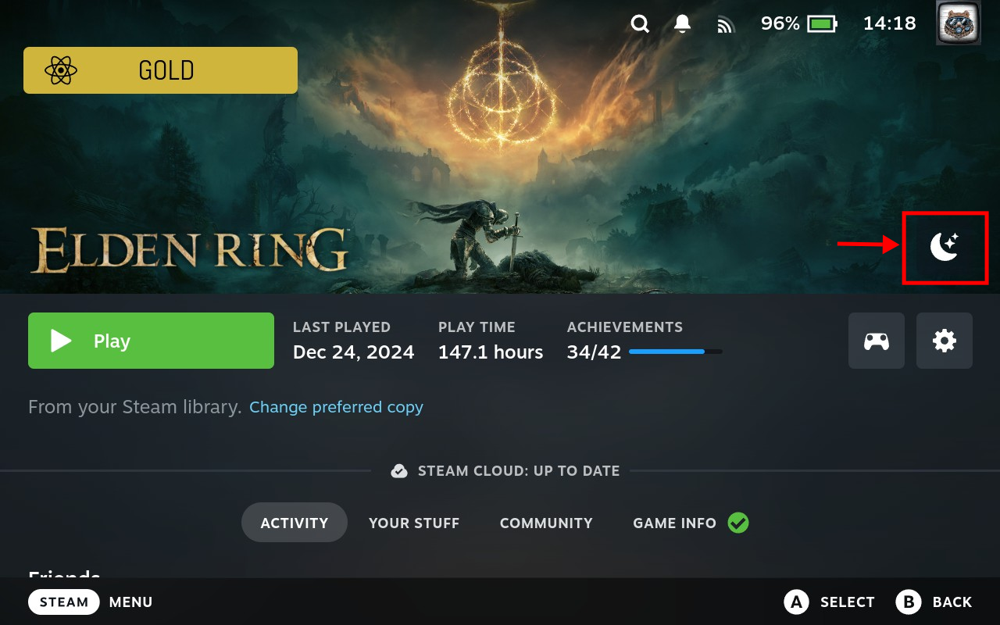
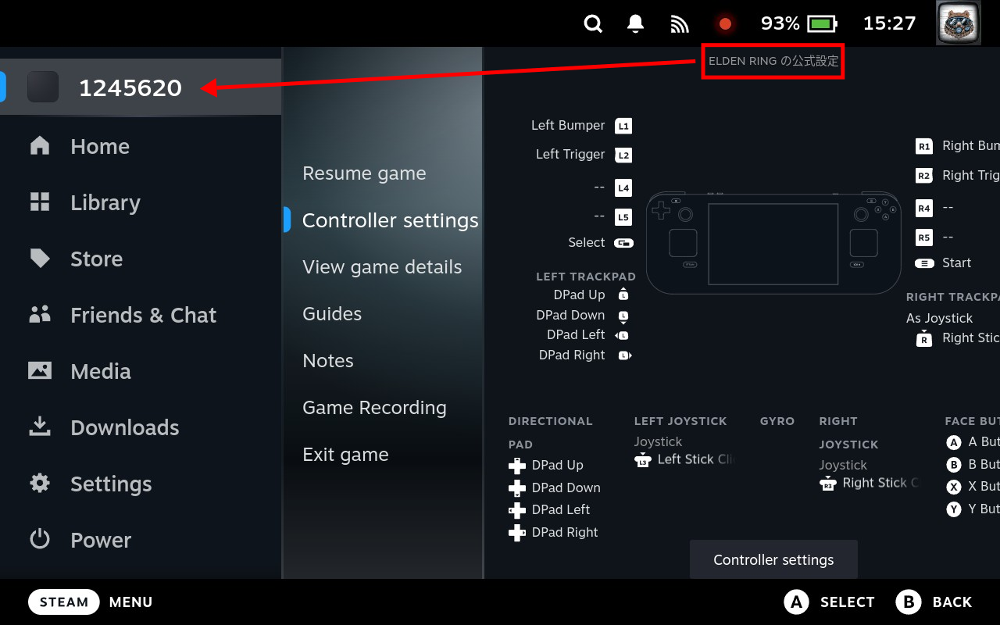

# MoonDeck   

A plugin that lets you play any of your Steam games via Moonlight without needing to add them to Sunshine first, providing a similar experience to GeForce GameStream or Steam Remote Play.

## What is it really?

MoonDeck is an automation tool that will simplify launching your Steam games via the Moonlight client for streaming. It simplifies the launch of a specific game to a single click, similar to how Steam's Remote Play feature works.

It requires an additional lightweight app to be installed on the host PC - [MoonDeck Buddy](https://github.com/FrogTheFrog/moondeck-buddy). Additional one-time setup instructions can be found within the settings page of the plugin itself.

## Why would I need it?
***Game streaming via Moonlight, by DEFAULT, follows these steps:***

1. Open moonlight as an application on the steam deck
2. Select a Host machine to stream from
3. Select an application to stream, usually steam Big Picture Mode (BPM)
5. Select a game via BPM interface 
6. Selected Game is launched

***Game Streaming via MOONDECK follows these steps:***
1. Press Moondeck button on game to stream within SteamDeck's OS 
2. Selected Game is launched via moonlight stream

***Moondeck*** sets configurations ahead of time and skipping many of the steps each time a stream is started. This allows a streamlined experience of selecting a game directly from the steam deck's OS and immediately starting the game stream.

**More importantly, the ***DEFAULT Moonlight*** method causes SteamDeck's OS to ONLY see *Moonlight* as the running application, rather than *any specific game*.**
**This creates a few problems, such as:**

- game-specific community controller profiles cannot detect the currently streamed game, preventing them from being downloaded or viewed
- controller settings are tied to the overall *Moonlight* application, requiring manual reconfiguration when switching between streamed games
- performance profiles are linked to the *Moonlight* application, also requiring manual reconfiguration when switching between streamed games
- steam game guides for a streamed game cannot be found

**Moondeck fixes this issue by adding a button to each game within the Steamdeck's OS to launch directly into a moonlight stream with ***Steam's specific game title ID #*** associated for the running application in SteamDeck's OS.**

The result is that per streamed game ***community controller profiles automatically associate, can be downloaded, and modified*** and ***performance profiles via the QAM can be created, saved, and modified***

**Note: Unfortunately, steam game guides are not working yet**

---
# For Devs

## Building

1. Clone this repo to the `~/homebrew/plugins`.
2. Install pnpm via npm `npm install --global pnpm`.
3. Run `pnpm install` in the cloned repo directory.
4. Build using `pnpm run build-dev` for local build.

## Internal data

This plugin stores data in the following directories:

* Settings - `/home/$USER/.config/moondeck/settings.json`
* Backend logs - `/tmp/moondeck.log`
* Runner logs - `/tmp/moondeck-runner.log`
* Moonlight logs - `/tmp/moondeck-runner-moonlight.log`

Additional frontend logs are written to the `web console`.

## License

This is licensed under GNU GPLv3.
